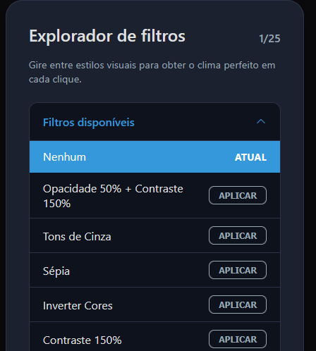
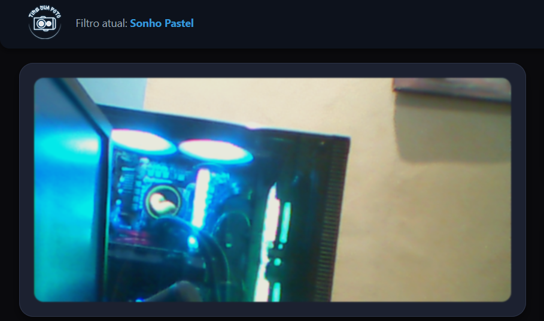
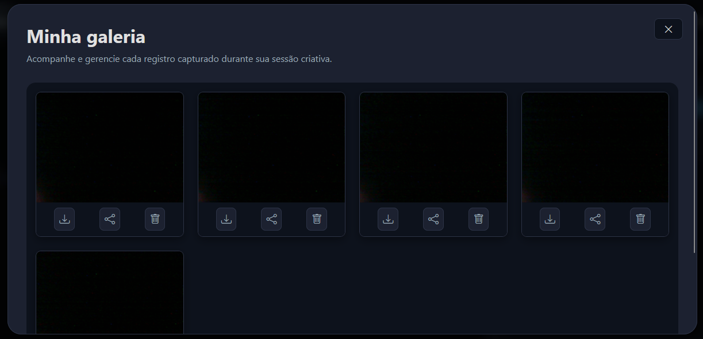
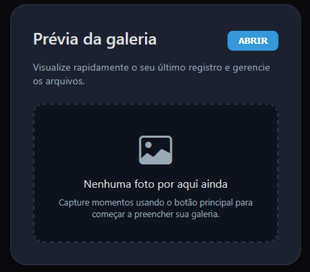
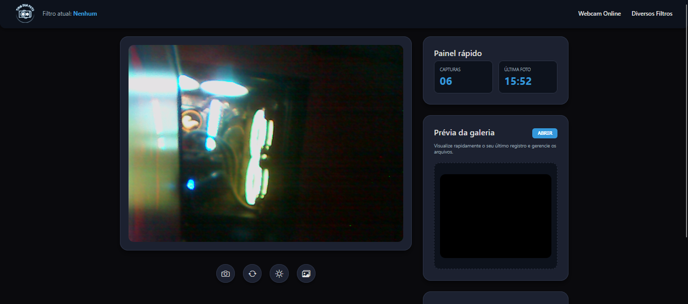
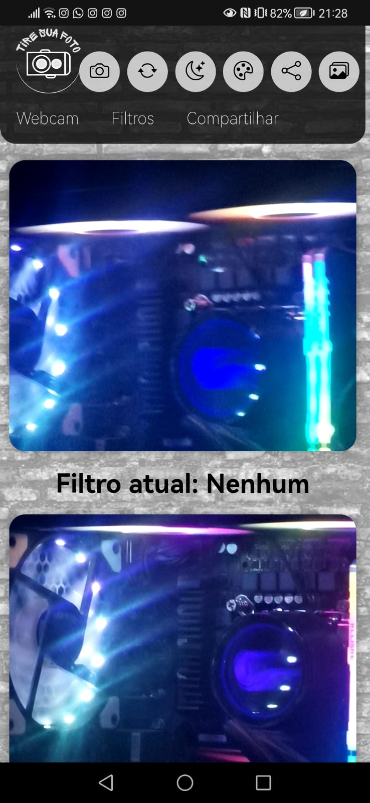

# 📸 Webcam Creative com Galeria, Filtros e Gravação de Vídeo

Este é um projeto visualmente envolvente e funcional desenvolvido com **HTML + CSS + TypeScript**, que permite capturar imagens da webcam, gravar vídeos com filtros em tempo real e gerenciá-los em uma galeria interativa.

> 🚀 Um projeto que une **design responsivo**, performance e usabilidade com boas práticas de desenvolvimento frontend.

---

## 📌 Funcionalidades Principais

- ✅ **Captura de imagem** diretamente da webcam.
- ✅ **Gravação de vídeo** com filtros aplicados em tempo real.
- ✅ **Explorador de Filtros** com mais de **25 efeitos** aplicáveis em tempo real.
- ✅ **Galeria unificada** para fotos e vídeos com opções de **Download**, **Compartilhamento** e **Exclusão**.
- ✅ **Reprodução de vídeos** diretamente na galeria com controles intuitivos.
- ✅ Interface **responsiva** adaptada para **mobile, tablet e desktop**.
- ✅ **Modo Claro e Escuro** com troca dinâmica de tema (suporte a *system preference*).
- ✅ **Indicador visual de gravação** com animações em tempo real.
- ✅ Botões grandes e acessíveis para uso em **touch mobile**.

---

## ✨ Explorador de Filtros Interativo

Aprimore suas capturas com uma ampla gama de estilos visuais. Os **25 filtros** exploram desde ajustes básicos (brilho, contraste) até estilos mais criativos:

- **Efeitos Clássicos:** Tons de Cinza, Sépia, Inverter Cores.
- **Efeitos de Estilo:** Lomo (Noturno Antigo), Pop-Art (Cores Primárias), Visão Infravermelho.
- **Efeitos Artísticos:** Sonho Pastel, Aquarela Borrada.

| Menu de Filtros (Fechado por Padrão) | Filtro em Ação |
|--------------------------------------|----------------|
|  |   |

---

## 💾 Galeria de Mídia e Gerenciamento Local

Todas as capturas (fotos e vídeos) são armazenadas de forma **local e privada** no seu navegador, sem envio a servidores externos, garantindo total **segurança e privacidade**.

A galeria interativa (Modal) permite que você:

- **Visualize** todos os seus registros (fotos e vídeos) em um grid moderno.
- **Reproduza vídeos** diretamente na galeria com controles de play/pause.
- Faça o **Download** instantâneo de qualquer mídia em alta qualidade (`.png` para fotos, `.webm` para vídeos).
- **Compartilhe** suas criações usando a API nativa do navegador.
- **Exclua** arquivos individualmente para gerenciar o seu espaço.
- Visualize a **duração dos vídeos** com badges informativos.

| Galeria com Fotos e Vídeos (Modal) | Prévia da Galeria (Painel Lateral) |
|------------------------------------|------------------------------------|
|  |  |

---

## 🎥 Gravação de Vídeo com Filtros

A funcionalidade de gravação permite criar vídeos únicos com os mesmos filtros disponíveis para fotos:

- **Gravação em tempo real** com filtros aplicados durante todo o processo.
- **Indicador visual** mostrando quando a gravação está ativa.
- **Áudio sincronizado** capturado junto com o vídeo.
- **Controle intuitivo** com botão que alterna entre gravar/parar.
- **Armazenamento automático** na galeria após finalizar a gravação.
- **Formato WebM** otimizado para web com codec VP9.
- **Reprodução integrada** na galeria com controles de play/pause.

---

## 🧪 Tecnologias e Boas Práticas

| Ferramenta | Descrição |
|------------|-----------|
| [TypeScript](https://www.typescriptlang.org/) | Usado para garantir a **tipagem estática**, resultando em um código mais robusto, escalável e de fácil manutenção. |
| [MediaRecorder API](https://developer.mozilla.org/en-US/docs/Web/API/MediaRecorder) | API nativa para gravação de vídeo com filtros aplicados em tempo real. |
| [Canvas API](https://developer.mozilla.org/en-US/docs/Web/API/Canvas_API) | Renderização de filtros CSS em tempo real durante a gravação de vídeo. |
| [getUserMedia API](https://developer.mozilla.org/en-US/docs/Web/API/MediaDevices/getUserMedia) | Acesso seguro à câmera e microfone do usuário. |
| [CSS3 & Variáveis CSS] | Estilização moderna, responsiva e com **Variáveis CSS** para uma troca de tema limpa e eficiente. |
| [HTML5](https://developer.mozilla.org/pt-BR/docs/Web/HTML) | Estruturação semântica e acessível (incluindo o uso da tag `<details>` para o menu de filtros). |
| [Bootstrap Icons](https://icons.getbootstrap.com/) | Ícones acessíveis e elegantes. |
| [Vercel](https://vercel.com/) | Deploy automatizado e hospedagem web. |

---

## 🖼️ Layout Responsivo e Temas Dinâmicos

O layout foi desenvolvido com uma abordagem *mobile-first*, garantindo uma experiência otimizada em qualquer tamanho de tela e alternando o visual entre os temas escuro e claro.

| Desktop (Tema Escuro) | Mobile (Tema Claro) |
|-----------------------|---------------------|
|  |  |

---

## 🌐 Deploy Online

> ✅ O projeto está disponível para uso imediato!

[🔗 **Acesse agora na Vercel**](https://webcam-mauve.vercel.app/)

---

## 📦 Instalação Local

```bash
# Clone o repositório
git clone [https://github.com/seu-usuario/webcam-galeria.git](https://github.com/seu-usuario/webcam-galeria.git)
cd webcam-galeria

# Instale dependências do TypeScript (se houver)
# npm install

# Para executar, basta abrir o arquivo index.html em um navegador moderno (como Chrome ou Firefox).

```

🤝 Contribuições

Contribuições, sugestões e relatórios de bugs são sempre bem-vindos! Sinta-se à vontade para abrir uma issue ou um pull request no repositório.

👨‍💻 Autor

Desenvolvido com dedicação por: Anathyon Erysson

    📫 Email: anathyon@protonmail.com

    🔗 LinkedIn: Anathyon Erysson
