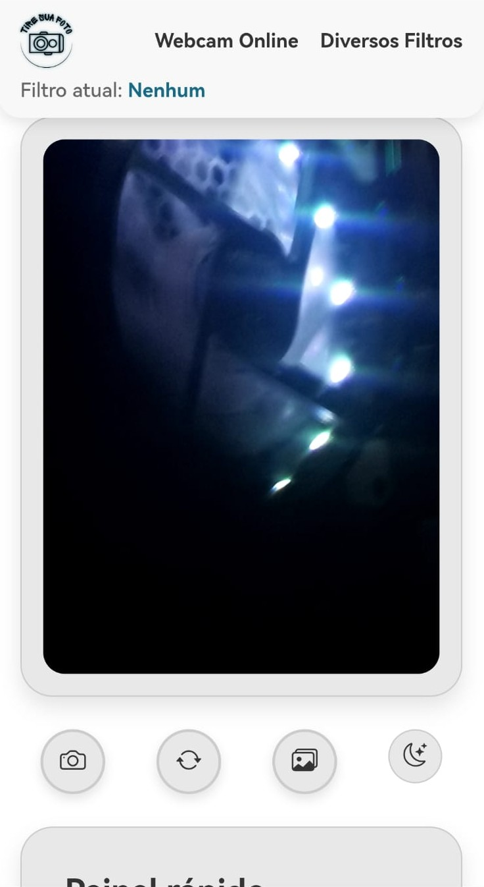

# 📸 Webcam Interativa com Galeria de Fotos

Este é um projeto desenvolvido com **HTML + CSS + TypeScript**, hospedado na **Vercel**, que permite capturar imagens da webcam, visualizá-las em uma galeria moderna e interativa, além de contar com suporte completo para dispositivos móveis e tema escuro/claro.

> 🚀 Um projeto visualmente envolvente e funcional, que une design responsivo, performance e usabilidade com boas práticas de desenvolvimento frontend.

---

## 📌 Funcionalidades

- ✅ Captura de imagem diretamente da webcam
- ✅ Salvamento de imagens em galeria local com opções de **download** e **exclusão**
- ✅ Interface **responsiva** adaptada para **mobile, tablet e desktop**
- ✅ **Modo claro e escuro** com troca dinâmica de tema
- ✅ Ícones otimizados com **Bootstrap Icons**
- ✅ Botões grandes e acessíveis para uso em **toque mobile**
- ✅ Animações suaves e layout com design moderno

---

## 🧪 Tecnologias Utilizadas

| Ferramenta | Descrição |
|------------|-----------|
| [HTML5](https://developer.mozilla.org/pt-BR/docs/Web/HTML) | Estruturação semântica |
| [CSS3](https://developer.mozilla.org/pt-BR/docs/Web/CSS) | Estilo moderno, responsivo e temático |
| [TypeScript](https://www.typescriptlang.org/) | Manipulação da webcam, galeria e lógica de interação |
| [Bootstrap Icons](https://icons.getbootstrap.com/) | Ícones acessíveis e elegantes |
| [Vercel](https://vercel.com/) | Deploy automatizado e hospedagem web |

---

## 🖼️ Layout Responsivo

> 💻 Desktop | 📱 Mobile

| Desktop             | Mobile              |
|---------------------|---------------------|
<div align="center">
  
  
</div>

---

## 🎨 Temas Dinâmicos

O site possui suporte ao **modo claro** e **modo escuro**, trocando automaticamente ícones, fundo, botões e fontes para melhorar a experiência visual em qualquer ambiente.

| Tema Escuro | Tema Claro |
|-------------|------------|
| Fundo escuro com textos claros | Fundo claro com textos escuros |
| Ícones e botões adaptados | Contrastes otimizados |

---

## 🌐 Deploy Online

> ✅ O projeto está disponível online!

[🔗 Acesse agora na Vercel](https://webcam-mauve.vercel.app/)

---

## 📦 Instalação Local

```bash
# Clone o repositório
git clone https://github.com/seu-usuario/webcam-galeria.git
cd webcam-galeria

# (Opcional) Instale dependências do TypeScript
npm install

# Execute localmente
# Basta abrir o arquivo index.html em um navegador moderno
```

---

## 🔒 Segurança e Privacidade

- O acesso à webcam é solicitado apenas localmente
- Nenhuma imagem é enviada para servidores externos
- Todo o controle é feito no navegador do usuário

---

## 🤝 Contribuições

Contribuições são bem-vindas!  
Sinta-se à vontade para abrir uma issue ou pull request com sugestões, bugs ou melhorias.

---

## 👨‍💻 Autor

Desenvolvido com dedicação por: **Anathyon Erysson**  
📫 anathyonerysson@protonmail.com  
🔗 [LinkedIn](https://www.linkedin.com/in/anathyonerysson/)
